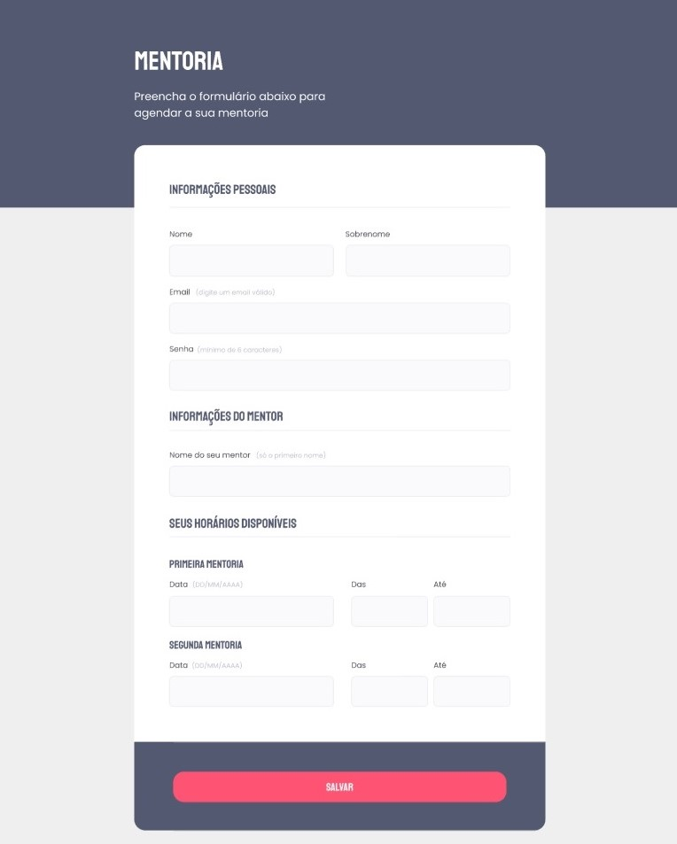

<h1 align="center"> Mentoria </h1>

Nesse desafio intermediário, recriei uma aplicação a partir de um layout, para por em prática todo o conteúdo que vi até agora no Stage 03 do Explorer.
  

  <a href="#-tecnologias">Tecnologias</a>&nbsp;&nbsp;&nbsp;|&nbsp;&nbsp;&nbsp;
  <a href="#-projeto">Projeto</a>&nbsp;&nbsp;&nbsp;|&nbsp;&nbsp;&nbsp;
  <a href="#-layout">Layout</a>&nbsp;&nbsp;&nbsp;|&nbsp;&nbsp;&nbsp;
  <a href="#memo-licença">Licença</a>

  

 

  

## 🚀 Tecnologias

Esse projeto foi desenvolvido com as seguintes tecnologias:

- HTML e CSS
- Git e Github
- Figma

## 💻 Projeto

É um simples formulário de um site.

- [Visite o projeto online](https://bielmoreno.github.io/desafio-form-mentoria/)

## 🔖 Layout

Você pode visualizar o layout do projeto através [DESSE LINK](https://www.figma.com/file/Nws1KWB7DyXBw8L6wXb9mp/Stage-03---Formul%C3%A1rio-intermedi%C3%A1rio/duplicate).

## :memo: Licença

Esse projeto está sob a licença MIT.

---

Feito com ♥ by Rocketseat :wave: [Participe da nossa comunidade!](https://www.discord.gg/rocketseat)